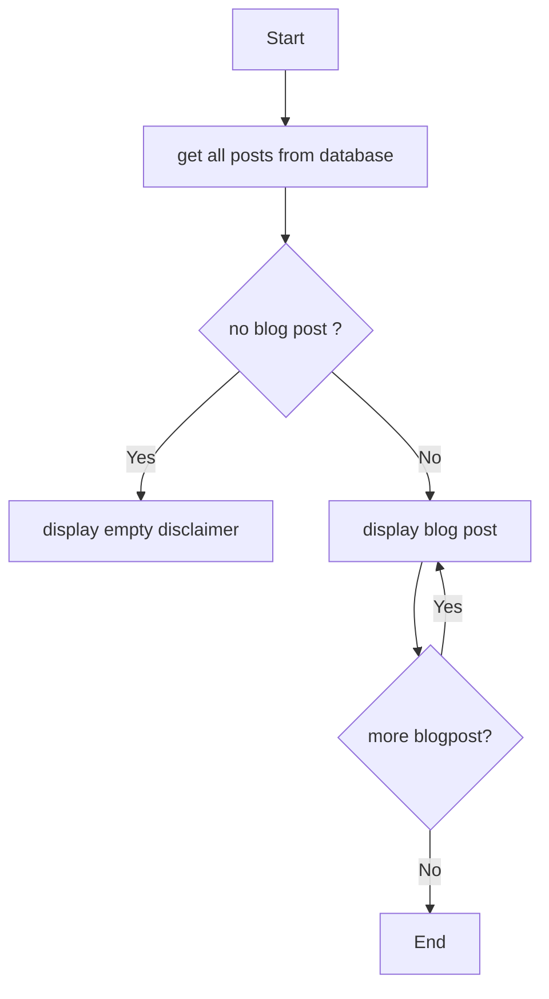
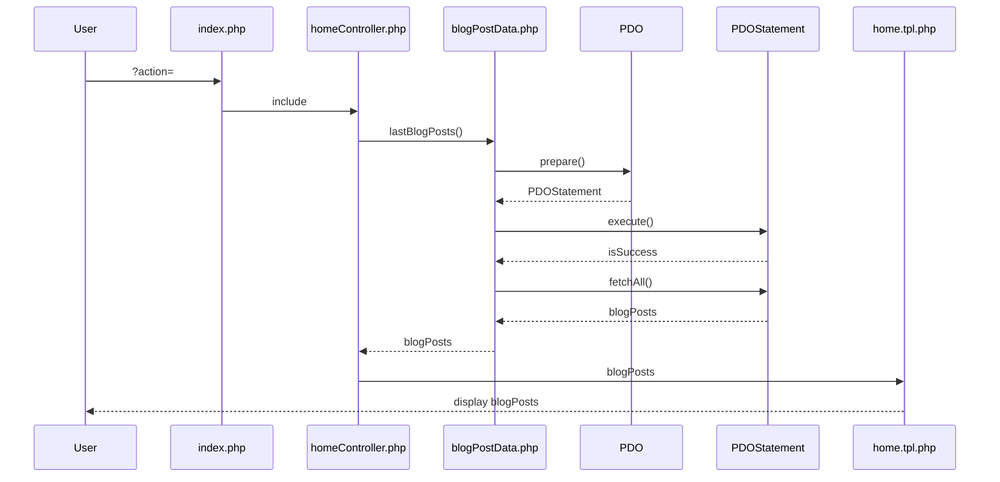
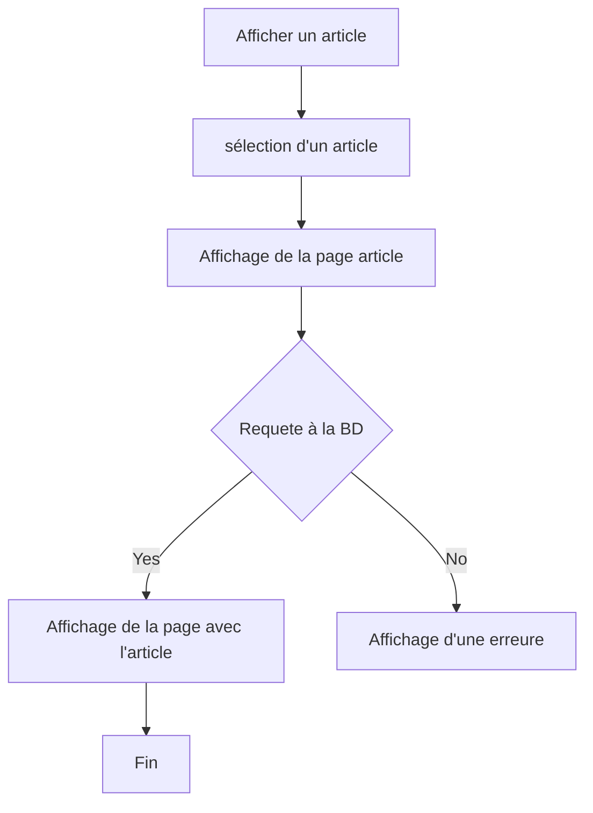
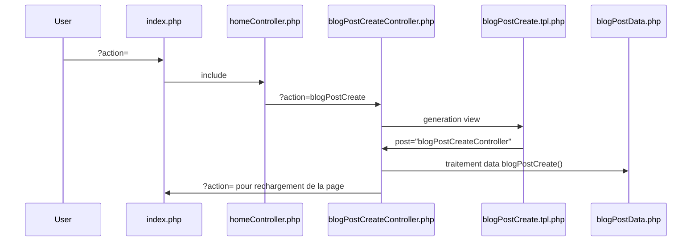
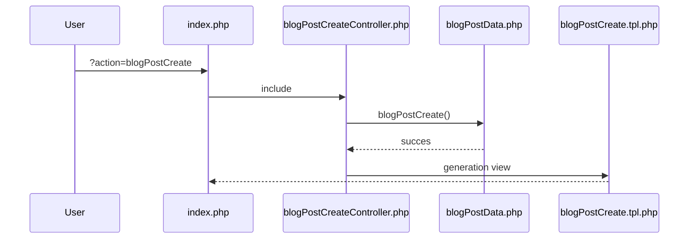

```mermaid
graph TD
    A[Start] --> B[get all posts from database]
    B --> C{no blog post ?}
    C -- Yes --> D[display empty disclaimer]
    C -- No --> E[display blog post]
    E --> F{more blogpost?}
    F -- Yes --> E
    F -- No --> G[End]
```

```mermaid
sequenceDiagram
User->>index.php: ?action=
index.php->>homeController.php: include
homeController.php->>blogPostData.php: lastBlogPosts()
blogPostData.php->>PDO: prepare()
PDO-->>blogPostData.php: PDOStatement
blogPostData.php->>PDOStatement: execute()
PDOStatement-->>blogPostData.php: isSuccess
blogPostData.php->>PDOStatement: fetchAll()
PDOStatement-->>blogPostData.php: blogPosts
blogPostData.php-->>homeController.php: blogPosts
homeController.php->>home.tpl.php: blogPosts
home.tpl.php-->>User: display blogPosts
```

```mermaid

graph TD

A[Afficher un article] --> B[sélection d'un article]

B --> C[Affichage de la page article]

C -->D{Requete à la BD}

D -- Yes --> E[Affichage de la page avec l'article]

D -- No --> F[Affichage d'une erreure]

E --> G[Fin]

```

```mermaid
sequenceDiagram
    User ->> index.php: ?action=
    index.php ->> homeController.php: include
    homeController.php ->> blogPostCreateController.php: ?action=blogPostCreate
    blogPostCreateController.php ->> blogPostCreate.tpl.php: generation view
    blogPostCreate.tpl.php ->> blogPostCreateController.php : post="blogPostCreateController"
    blogPostCreateController.php ->> blogPostData.php : traitement data blogPostCreate()
    blogPostCreateController.php ->> index.php : ?action= pour rechargement de la page
    
```

```mermaid
sequenceDiagram
    User ->> index.php: ?action=blogPostCreate
    index.php ->> blogPostCreateController.php: include
    blogPostCreateController.php ->> blogPostData.php : blogPostCreate()
    blogPostData.php -->> blogPostCreateController.php  : succes
    blogPostCreateController.php ->> blogPostCreate.tpl.php: generation view
    blogPostCreate.tpl.php -->> index.php : 
```